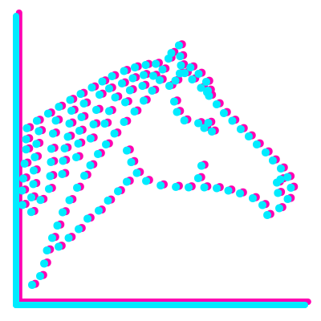
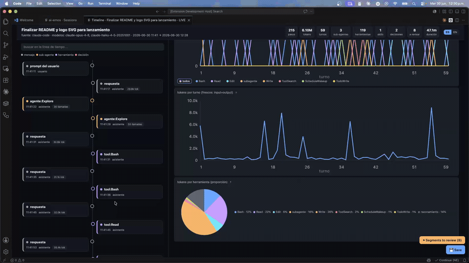

<p align="center">
  
</p>

<h1 align="center">ai-emos</h1>

<p align="center">
  <b>Observabilidad de flujos de trabajo con IA</b>, agnóstica al modelo/sistema.
</p>

<p align="center">
  
</p>

---

## 1. ¿Qué es y para qué sirve?

Tienes observabilidad de tu *producto*; **ai-emos te da observabilidad de cómo
trabajó la IA**. A partir del historial de una sesión reconstruye un catastro
interactivo (HTML): qué agentes, sub-agentes, skills y herramientas se tocaron, su
I/O, los puntos *human-in-the-loop* (dónde decidiste tú), los tokens por turno, y los
**tramos a revisar** para iterar tu desarrollo con criterio.

Te sirve para:

- **Iterar tu agente/flujo con datos**, no a ojo: ver el camino real que tomó la IA.
- **Encontrar el gasto**: sub-agentes caros (≥ p90 de tokens), caché fría, turnos
  pesados.
- **Encontrar la fricción**: errores de herramienta, reintentos, interrupciones,
  sub-agentes lentos.
- **Auditar decisiones**: dónde te preguntó, qué elegiste tú, dónde decidió sola.
- **Comparar sistemas** (Claude Code, agentes propios, OTel, Cursor, Codex…) con una
  misma lente.

### Por qué es agnóstico

El corazón no es un parser de Claude: es un **esquema canónico de traza**
([core/trace-schema.md](core/trace-schema.md), alineado a OpenTelemetry-GenAI /
OpenInference) + **adaptadores por fuente**. El visor (HTML) consume solo la traza
canónica, así que **sumar un sistema = un adaptador, sin tocar la UI**.

### Eficiencia en tokens

El trabajo pesado lo hace un script Node (transcript → JSON); un `template.html`
estático aporta la interactividad; el modelo solo corre el script. **El historial
nunca entra al contexto del modelo** ⇒ el costo en tokens de generar el visor es
~constante, sin importar el tamaño de la sesión.

---

## 2. Instalación — y cuándo usar cada una

`ai-emos` es un **monorepo** con un núcleo agnóstico (`core/` + `sdk/` + templates) y
**dos frontends finos e independientes** encima. Elige según cómo trabajes:

| Quieres… | Usa… | No necesitas… |
|---|---|---|
| Panel visual nativo dentro de VS Code / Cursor / VSCodium | **Extensión de VS Code** | el plugin |
| Que un agente/chat genere el HTML portable (terminal, CI, Cursor) | **Plugin de Claude Code** | la extensión |
| Correr en CI, terminal o scripts sin instalar nada | **CLI autónomo** | nada más |
| Disparar desde el chat y abrir el panel nativo de la extensión | **Ambos** (handoff `vscode://`) | — |

**Extensión de VS Code — desde el release (recomendado, sin compilar):** descarga el
`.vsix` de la [última release](https://github.com/SieteAses/ai-emos/releases/latest) e
instálalo (también sirve en Cursor / VSCodium):

```sh
code --install-extension ai-emos-0.1.0.vsix
# o en VS Code: Cmd/Ctrl+Shift+P → "Extensions: Install from VSIX…"
```

Luego: `Cmd/Ctrl+Shift+P` → **ai-emos: Sesiones**.

> Cuando esté publicado en el Marketplace / Open VSX bastará con buscar "ai-emos" en la
> pestaña de Extensiones (o `code --install-extension SieteAses.ai-emos`).

**Plugin de Claude Code** (marketplace Git):

```
/plugin marketplace add SieteAses/ai-emos
/plugin install ai-emos@ai-emos
```

Para desarrollo local del plugin sin marketplace: `bash setup.sh` (enlaza las skills
en `~/.claude/skills`).

**CLI autónomo** (no requiere Claude Code):

```sh
# listar sesiones de Claude Code
node skills/visualize-session/scripts/cli.mjs --list --since 7d

# timeline de una sesión → HTML self-contained
node skills/visualize-session/scripts/cli.mjs --session <id> --html ./timeline.html

# dashboard cross-sesión
node skills/visualize-session/scripts/cli.mjs --dashboard --since 7d --html ./dashboard.html

# otras fuentes (autodetecta por extensión, o usa --adapter)
node skills/visualize-session/scripts/cli.mjs --session ./run.ndjson --html out.html
node skills/visualize-session/scripts/cli.mjs --adapter otel-genai --session ./spans.json --html out.html
```

> El `.vsix` de la extensión es **self-contained** (incluye `core/` + assets): funciona
> sin el repo ni el plugin. Y el plugin **no requiere** la extensión. Dentro de VS Code,
> `cli.mjs --session <id> --open auto` hace **handoff** al panel nativo; fuera, genera
> el HTML standalone.

---

## 3. Qué está soportado y validado

`ai-emos` es multi-fuente por diseño. Para ser honestos, distinguimos lo que el autor
ya **validó end-to-end** de lo que está **implementado pero sin validar** todavía
(ayuda muy bienvenida — ver §4).

### ✅ Validado por el autor

| Qué | Detalle |
|---|---|
| **Fuente: Claude Code** | adaptador `claude-code`; transcripts automáticos en `~/.claude/projects` |
| **Fuente: GitHub Copilot** | adaptador `vscode-chat` (alias `copilot`). **Fusiona** dos rastros de VS Code: el panel (`chatSessions/<id>.jsonl`) aporta el prompt del usuario, la respuesta final y los **tokens**; el transcripto de Copilot (`GitHub.copilot-chat/transcripts/<id>.jsonl`) aporta el trabajo agéntico intermedio (razonamiento + ejecución de herramientas). Validado contra una sesión real en agent-mode. **Límites**: el contenido de salida de cada tool no se guarda (solo éxito/fallo); una sesión **en curso** solo muestra el transcripto hasta que se completa y se vuelca al panel. |
| **LLM-judge `harness`** | usa el modelo del chat (Claude) — cero key, cero costo extra |
| **LLM-judge `local`** | modelo local OpenAI-compatible (**Ollama** / LM Studio) — sin key, sin costo |

### 🧪 Implementado, aún sin validar end-to-end (best-effort)

Adaptadores existentes en `core/adapters/`. Funcionan, pero el autor no los ha probado
contra datos reales de cada versión. **Si los pruebas, [reporta](https://github.com/SieteAses/ai-emos/issues)**:

| fuente | adaptador | cómo |
|---|---|---|
| **agentes propios** | `ndjson` | mini-SDK `sdk/emit.{mjs,py}` → archivo NDJSON |
| **OpenTelemetry-GenAI / OpenInference** | `otel-genai` | export OTLP-JSON |
| **OpenAI / Codex CLI** | `openai-codex` | rollouts JSONL en `~/.codex/sessions` |
| **Cursor** | `cursor` | export JSON del chat |
| **opencode** | `opencode` | SQLite en `~/.local/share/opencode/opencode.db` |
| **LLM-judge `api`** | — | Anthropic u OpenAI-compatible con key (solo si la tienes) |

> El adaptador `vscode-chat` también puede leer otros modelos del chat de VS Code vía
> `chatSessions/*.jsonl` (formato snapshot+patch), pero ese rastro solo se llena al
> cerrar la sesión y no está validado fuera de Copilot.

¿Otra fuente? Copia [`core/adapters/_template.mjs`](core/adapters/_template.mjs).

### Honestidad de tokens

La granularidad real es **por turno de LLM y por sub-agente**, no por herramienta. El
visor lo refleja; las fuentes que no reportan tokens muestran "n/d".

El titular de tokens (timeline y lista) son **tokens frescos = input + output**: lo que
el modelo realmente generó/ingirió nuevo. El **total bruto** (visible en el tooltip)
incluye el `cacheRead` —el contexto cacheado que se **re-lee en cada turno**—, que es
barato (~10% de un token normal) pero, contado por turno, dispara la cifra a "millones"
aunque sea el mismo contenido una y otra vez. Por eso el titular usa frescos y deja el
desglose (total / caché re-leída / caché creada) a un lado.

### "Tramos a revisar"

Cada hallazgo se etiqueta con `category` + `severity`:

- **eficiencia** — caché fría, sub-agente caro (≥ p90 de tokens).
- **fricción** — errores de tool, reintentos, interrupciones.
- **latencia** — sub-agente lento (≥ p90 de duración).
- **calidad** — respuesta/razonamiento flojo. Lo detecta un paso **opcional** de
  LLM-judge ([core/judge.mjs](core/judge.mjs)), backend-agnóstico (`harness` / `local`
  / `api`, ver tabla arriba).

Las tres primeras categorías son **mecánicas** (cero LLM, cero tokens).

---

## 4. Cómo contribuir

Es un proyecto joven (MIT) y la colaboración es bienvenida. Lo más útil ahora mismo:

- **Validar un adaptador 🧪** contra datos reales y [abrir un Issue](https://github.com/SieteAses/ai-emos/issues)
  con qué encajó o no — eso lo mueve a ✅.
- **Sumar una fuente nueva**: copia [`core/adapters/_template.mjs`](core/adapters/_template.mjs);
  el visor y el núcleo no cambian.
- **Pulir** UI/traducciones (la UI es bilingüe ES/EN), criterios o docs.

Guía completa en [CONTRIBUTING.md](CONTRIBUTING.md).

---

## Layout

```
core/                    # AGNÓSTICO
  trace-schema.{md,json} # esquema canónico (contrato)
  render.mjs             # traza → datos para el HTML + findings mecánicos
  judge.mjs              # LLM-judge opcional, backend-agnóstico
  adapters/              # un adaptador por fuente (detect/parse/listSessions)
sdk/emit.{mjs,py}        # mini-SDK NDJSON para agentes propios
skills/
  visualize-session/     # genera el HTML (timeline / dashboard)
  instrument-source/     # verifica captura / hooks / SDK / OTel
vscode-extension/        # frontend de VS Code (self-contained al empaquetar)
docs/transcript-schema.md# formato nativo de Claude Code (referencia)
```

## Complementario a `session-report`

La skill oficial `session-report` da **analítica agregada de costo** (tokens por
proyecto/skill/subagente) solo de Claude Code. `ai-emos` se enfoca en el **flujo de una
sesión** y los **puntos de decisión**, y es **multi-fuente**.
